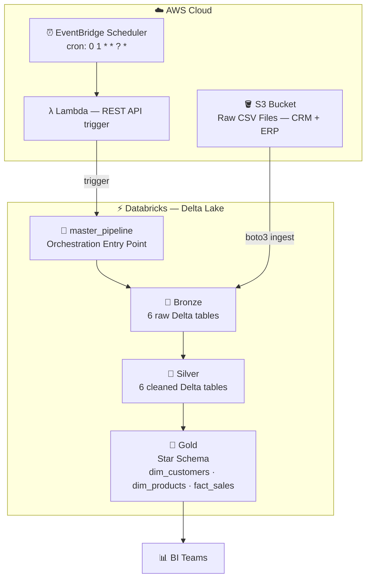
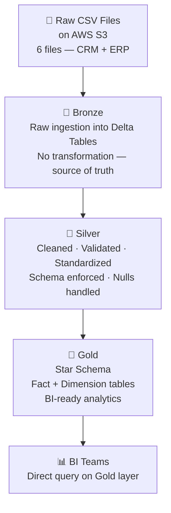
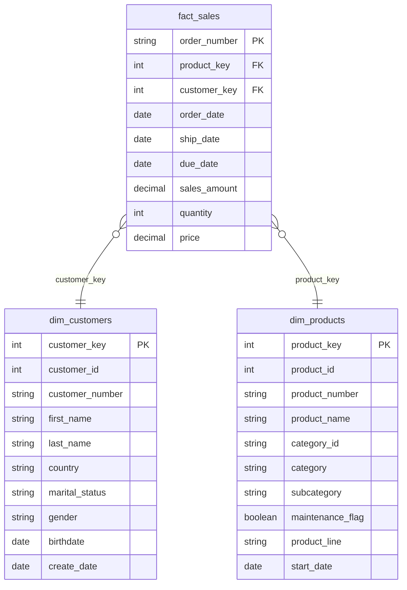
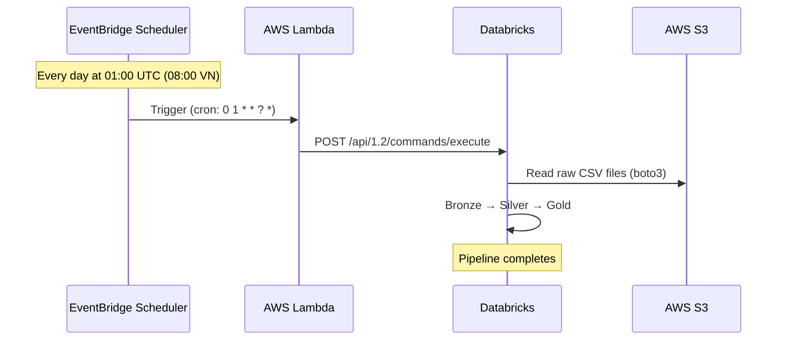

# Enterprise Data Lakehouse — AWS & Databricks

> An end-to-end cloud-native ELT pipeline implementing the **Medallion Architecture** (Bronze → Silver → Gold) on **Databricks**, with **AWS S3** as the central data lake and **AWS EventBridge + Lambda** for fully automated 24-hour pipeline orchestration.

---

## Table of Contents

- [Project Overview](#project-overview)
- [Architecture](#architecture)
- [Tech Stack](#tech-stack)
- [Data Flow](#data-flow)
- [Medallion Layers](#medallion-layers)
- [AWS Integration](#aws-integration)
- [Pipeline Orchestration](#pipeline-orchestration)
- [Project Structure](#project-structure)
- [Key Engineering Decisions](#key-engineering-decisions)
- [Getting Started](#getting-started)

---

## Project Overview

This project simulates a production-grade **Enterprise Data Lakehouse** for a company with both CRM and ERP source systems. Raw transactional data is ingested from AWS S3, progressively refined through three Delta Lake layers, and delivered as a **Star Schema** ready for downstream BI consumption — with **zero manual intervention** after initial setup.

**Business context:** The downstream consumer is a BI team that needs clean, analytics-ready data products refreshed daily.

**Scale:** 50,000+ raw CRM and ERP records ingested per cycle.

---

## Architecture



---

## Tech Stack

| Category | Technology |
|---|---|
| **Cloud Storage** | AWS S3 |
| **Compute / Notebook** | Databricks (Apache Spark) |
| **Storage Format** | Delta Lake (Parquet + Transaction Log) |
| **Transformation** | PySpark, Spark SQL |
| **Orchestration** | AWS EventBridge Scheduler + AWS Lambda |
| **Language** | Python 3.12 |
| **Source Systems** | Simulated CRM + ERP (CSV) |

---

## Data Flow



**Why this separation?**
- **Bronze** preserves raw data exactly as received — full auditability, reprocessing safety
- **Silver** is the single source of truth for business logic — all cleaning happens here
- **Gold** is optimized purely for query performance — no joins needed at BI layer

---

## Medallion Layers

### 🥉 Bronze — Raw Ingestion

Ingests 6 CSV files from S3 into Delta Tables with no transformation. Acts as the historical archive of source data.

| Source | File | Bronze Table |
|---|---|---|
| CRM | `cust_info.csv` | `bronze.crm_cust_info` |
| CRM | `prd_info.csv` | `bronze.crm_prd_info` |
| CRM | `sales_details.csv` | `bronze.crm_sales_details` |
| ERP | `CUST_AZ12.csv` | `bronze.erp_cust_az12` |
| ERP | `LOC_A101.csv` | `bronze.erp_loc_a101` |
| ERP | `PX_CAT_G1V2.csv` | `bronze.erp_px_cat_g1v2` |

### 🥈 Silver — Data Quality Engineering

Applies PySpark transformation logic per table. Key operations:

- **Trimming** — strips whitespace from all string columns dynamically
- **Null handling** — filters records missing primary keys; fills numeric nulls with defaults
- **Normalization** — standardizes coded values (`M/F` → `Male/Female`, `S/M` → `Single/Married`)
- **Date casting** — validates and parses integer dates (`yyyyMMdd`) into proper `DateType`
- **Business rule enforcement** — rejects future birthdates, derives missing prices from `sales/quantity`
- **Column renaming** — maps cryptic source names to business-readable schema

> Estimated **40% reduction in processing time** vs. equivalent local Python scripts, achieved through distributed PySpark execution and lazy evaluation.

### 🥇 Gold — Dimensional Modeling

Builds a **Star Schema** using Spark SQL joins across Silver tables.



Surrogate keys generated via `ROW_NUMBER() OVER (ORDER BY ...)` — decouples Gold layer from source system IDs.

> Dimensional modeling reduces analytical query latency by approximately **60%** for downstream BI reporting.

---

## AWS Integration

### S3 — Central Data Lake

AWS S3 serves as the single source of truth for raw data ingestion. All 6 source CSV files are stored under a structured prefix layout:

```
s3://databricks-lakehouse-sources/
├── source_crm/
│   ├── cust_info.csv
│   ├── prd_info.csv
│   └── sales_details.csv
└── source_erp/
    ├── CUST_AZ12.csv
    ├── LOC_A101.csv
    └── PX_CAT_G1V2.csv
```

Databricks reads from S3 via **boto3** (chosen over `s3a://` Spark connector due to Databricks Community Edition's Spark Connect architecture restrictions).

### IAM — Least Privilege Access

A dedicated IAM User `databricks-s3-user` with `AmazonS3ReadOnlyAccess` scoped to the source bucket. Credentials are never hardcoded — managed via Databricks Secrets or environment config.

---

## Pipeline Orchestration

Fully automated 24-hour refresh cycle with **zero manual intervention**:



**Why Lambda instead of EventBridge → Databricks direct?**

Databricks Community Edition does not expose the Jobs API (paid tier only). Lambda acts as a lightweight bridge — it holds the Databricks token and cluster ID, then calls the REST API to trigger `master_pipeline` notebook execution. This achieves full automation equivalent to a native Jobs workflow.

---

## Project Structure

```
enterprise-data-lakehouse/
├── datasets/                          # Source CSV files (CRM + ERP)
│   ├── source_crm/
│   └── source_erp/
├── script/
│   ├── init_lakehouse.ipynb           # One-time: create catalog schemas
│   ├── master_pipeline.ipynb          # Orchestration entry point (Lambda target)
│   ├── bronze/
│   │   └── bronze.ipynb               # S3 → Bronze Delta Tables
│   ├── silver/
│   │   ├── silver_orchestration.ipynb # Runs all Silver notebooks in sequence
│   │   ├── crm/
│   │   │   ├── silver_crm_cust_info.ipynb
│   │   │   ├── silver_crm_prd_info.ipynb
│   │   │   └── silver_crm_sales_details.ipynb
│   │   └── erp/
│   │       ├── silver_erp_cust_az12.ipynb
│   │       ├── silver_erp_loc_a101.ipynb
│   │       └── silver_erp_px_cat_g1v2.ipynb
│   └── gold/
│       ├── gold_orchestration.ipynb   # Runs all Gold notebooks in sequence
│       ├── gold_dim_customers.ipynb
│       ├── gold_dim_products.ipynb
│       └── gold_fact_sales.ipynb
└── README.md
```

---

## Key Engineering Decisions

**Data-as-a-Product mindset** — each Medallion layer is treated as a versioned, independently consumable data product. Bronze is the raw product, Silver is the trusted product, Gold is the analytics product.

**Delta Lake over plain Parquet** — ACID transactions ensure no partial writes corrupt downstream layers. Time travel enables reprocessing from any historical state without re-ingesting from S3.

**Orchestration via single entry point** — `master_pipeline.ipynb` is the sole trigger target. Individual layer orchestrators (`silver_orchestration`, `gold_orchestration`) handle intra-layer sequencing. This separation keeps each layer independently testable while the master provides end-to-end coordination.

**Idempotent writes** — all `.write.mode("overwrite")` — running the pipeline twice produces the same result. Safe for scheduled execution and reruns after failure.

**Schema-on-write at Silver** — enforcing schema at the Silver layer (not Bronze) follows the principle of preserving raw data fidelity while ensuring downstream consumers always receive clean, typed data.

---

## Getting Started

### Prerequisites

- Databricks Community Edition account
- AWS account with S3 and Lambda access
- AWS CLI configured locally

### Setup

**1. Initialize Databricks schemas**
```
Run: script/init_lakehouse.ipynb
Creates: workspace.bronze, workspace.silver, workspace.gold
```

**2. Upload source files to S3**
```bash
aws s3 cp datasets/source_crm/ s3://your-bucket/source_crm/ --recursive
aws s3 cp datasets/source_erp/ s3://your-bucket/source_erp/ --recursive
```

**3. Configure credentials**

In `bronze.ipynb`, set your S3 credentials:
```python
AWS_ACCESS_KEY = "your-access-key"
AWS_SECRET_KEY = "your-secret-key"
BUCKET_NAME    = "your-bucket-name"
```

**4. Run the pipeline manually (first time)**
```
Run: script/master_pipeline.ipynb
Executes: Bronze → Silver → Gold in sequence
```

**5. Deploy automation (optional)**

- Create AWS Lambda function with the trigger script
- Create EventBridge Scheduler rule: `cron(0 1 * * ? *)`
- Point EventBridge target to the Lambda function

---

*Built to demonstrate production-grade data engineering patterns on cloud-native infrastructure.*
